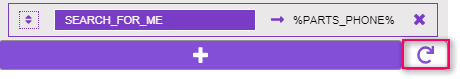

# README

## Introduction

The auto fill re-placer tool will aid in replacing text with its corresponding auto fill tag during the build of a landing page.

### Description

* This tool will crawl the editor window and replace all matching text with the designated auto fill tag.
* **Primarily meant for use WITH the migration tool.**

### Additional Details

* Tool will auto save after every change to the input areas.
  * Adding text
  * Deleting auto fill entries
  * Adding auto fill entries

### How to Use the Tool

#### During Migration:

1. Begin the migration process of an internal or external page.
2. On a blank landing page, choose external page to migrate.
3. 'Get' the URL of the external page
4. Choose the bucket the page will go into
5. **THE AUTO FILL TAG REPLACER TOOL**
6. Continue with the normal steps to migrate over the content

#### During Page Editing:

1. Choose a card to edit
2. Choose to edit 'Content'
3. A pop up will appear.
4. **RUN THE AUTO FILL TAG REPLACER TOOL**
5. Save changes via 'save' button.

### Working Environment\(s\)

* Only works in **Next Gen Mode \(Next Gen toggle = ON\)**
* Only works in **WSM \(Editor\) and CMS \(Content Library\)**
  * **Changes made in Editor**, changes are not permanent and will revert to original text upon page reload. Main purpose of the tool would is to make migrating copy text from external sites easier.
  * **Changes made in CMS \(Content Library\)**, are not permanent UNTIL you save the changes via one of the save button located at the top right area of the page.

### What the tool looks like


### Magic Wand Button


* This will trigger the tool's functionality

#### Editor

* Any text that has been designated inside the input areas will be found and replaced with it's corresponding Auto fill tag
* **Changes will not be permanent.**

#### CMS

* Any text that has been designated inside the input areas will be found and replaced with it's corresponding Auto fill tag
* **Save edits in order to keep the changes.**

### Magic Eye Button

 

* This will hide / show main panel for the tool.

### Auto Fill Options


### Reorder Purpose \(currently broken\)

You may be thinking 'Why would I even need to re-order the auto fill tags?' Well great question! Allow me to explain.

* There will be instances where text can be found in multiple auto fill tags.
  * For example if you had these auto fill set up in the tool:
    * INFINITI = %FRANCHISES%
    * INFINITI of Tampa = %DEALER\_NAME%
  * Example Text:
    * Welcome to INFINITI of Tampa!  See yourself in a INFINITI today!

      Using the example mentioned above:
* the tool would perform a search and replace for 'INFINITI' resulting in:
  * Welcome to %FRANCHISES% of Tampa!  See yourself in a %FRANCHISES% today!
* the tool will now perform a search and replace for 'INFINITI of Tampa' resulting in:
  * Welcome to %FRANCHISES% of Tampa!  See yourself in a %FRANCHISES% today!
  * As you can see nothing happened.  Because it didn't find an exact match = INFINITI of Tampa

If we reversed the order and moved %DEALER\_NAME% first then %FRANCHISES% the tool will perform as expected.

* Tool Set up:
  * INFINITI of Tampa = %DEALER\_NAME%
  * INFINITI = %FRANCHISES%
* Run tool on example above
* Search for 'INFINITI of Tampa'
  * Welcome to %DEALER\_NAME%!  See yourself in a INFINITI today!
* Search for 'INFINITI'
  * Welcome to %DEALER\_NAME%!  See yourself in a %FRANCHISES% today!

### Text to be replaced

Because some dealer's like to use different text for things.

* e.g. INFINITI of Tampa, could also be
  * Tampa INFINITI
  * INFINITI Tampa
* So to account for this, you can adjust the 'text to be replaced' and add all possible variations to the area.
* You can separate the variations by using two back-ticks \`\` \(the key above the 'tab' on your keyboard\)

#### Lets do a quick demo shall we?

Using the text mentioned above. I want to replace anything related to the dealer's name with the auto fill tag %DEALER\_NAME%. So I write this text into the auto fill text area.

```text
INFINITI of Tampa``Tampa INFINITI``INFINITI Tampa
```


When you click the 'Magic' button the tool will break down the text if it sees \`\` and start its search.

* round 1 = INFINITI of Tampa
* round 2 = Tampa INFINITI
* round 3 = INFINITI Tampa

### Deleting an Auto Fill

it will remove the auto fill tag from the search list

### Adding an Auto Fill


Clicking this will display a drop down of currently available auto fill tags that looks like this.

#### Why are the options greyed out?


Auto fill tags that have already been configured will be disabled. \(Depicted in grey in the screenshot\)

### Reset Button



Resets the tool to the most commonly used auto fill tags.

* %DEALER\_NAME%
* %FRANCHISES%
* %STREET%
* %CITY%
* %STATE%
* %ZIP%
* %PHONE%
* %NEW\_PHONE%
* %USED\_PHONE%
* %SERVICE\_PHONE%
* %PARTS\_PHONE%

