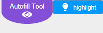
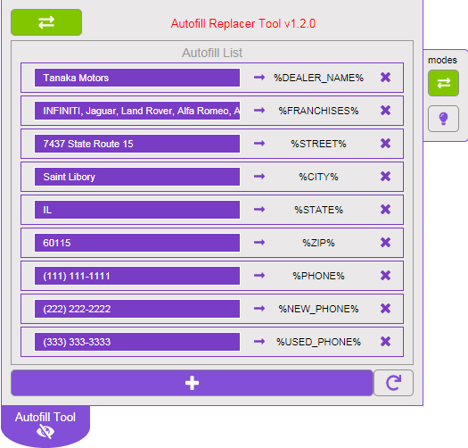
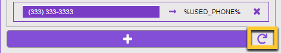

# Autofill Replacer
* a tool that will replace text with autofill tags

## Description :new:
* This tool will crawl the editor window and replace all matching text with the designated autofill tag.
* **Replace Mode - Primarily meant for use WITH the migration tool.**
* **Highlight Mode - Primarily meant for use in regular WSM editor.**

## Additional Details
* Tool will auto save after every change to the input areas.
    * Adding text
    * Deleteing autofill entries
    * Adding autofill entries

## Modes :new:
### Replace Mode
* Will replace all matching text with it's corresponding autofill tag.

### Highlight Mode
* Will highlight all the words that CAN BE updated using autofill tags.
    * Accomplishes this task by:
        1. Forcing the currently viewed page in WSM to show all the autofill tags. **(Page will reload)**
        2. Crawling the page and highlighting any words that can be converted to autofill tags.

## How to Use the Tool
### Replace Mode
#### During Migration:
1. Begin the migration process of an internal or external page.
2. On a blank landing page, choose external page to migrate.
3. 'Gett' the URL of the external page
4. Choose the bucket the page will go into
5. **THE AUTOFILL TAG REPLACER TOOL**
6. Continue with the normal steps to migrate over the content

#### During Page Editing:
1. Choose a card to edit
2. Choose to edit 'Content'
3. A pop up will appear.
4. **RUN THE AUTOFILL TAG REPLACER TOOL**
5. Save changes via 'save' button.

### Highlight Mode :new:
#### While editting cards in WSM
1. Navigate to landing page or core page in WSM
2. **RUN THE AUTOFILL TAG REPLACER TOOL**
3. Wait for tool to do it's work
4. Scan the page for any highlighted words.
5. If words are found, edit the contents of the record.
6. **RUN THE AUTOFILL TAG REPLACER TOOL** again
7. Words that can be converted to autofill tags will be replaced.
8. Hit save button.

## Working Environment(s)
* Only works in **NextGen Mode (Next Gen toggle = ON)**
* Only works in **WSM (Editor) and CMS (Content Library)**
    * **Changes made in Editor**, changes are not permanent and will revert to original text upon page reload. Main purpose of the tool would is to make migrating copy text from external sites easier.
    * **Changes made in CMS (Content Library)**, are not permanent UNTIL you save the changes via one of the save button located at the top right area of the page.

## What the tool looks like
* Minimized

* Maximized

## Magic Wand Button

* This will trigger the tool's functionality

### Replace Mode
#### Editor
* Any text that has been designated inside the input areas will be found and replaced with it's corresponding Autofill tag
* **Changes will not be permanent.**

#### CMS
* Any text that has been designated inside the input areas will be found and replaced with it's corresponding Autofill tag
* **Save edits in order to keep the changes.**

### Highlight Mode
#### Editor
* Refreshes the currently viewed page, then highlights all text designated in the input area of the tool

#### CMS
* DOES NOT WORK, will recieve an alert stating this.

## Magic Eye Button

* This will hide / show main panel for the tool.

## Autofill List Options Breakdown

## Delete autofill
it will remove the autofill tag from the search list

## Add autofill Button

Clicking this will display a drop down of currently available autofill tags that looks like this.

### Why are the options grey'd out?

Autofill tags that have already been configured will be disabled. (Depicted in grey in the screenshot)

## Reset Button

Resets the tool to the most commonly used autofill tags.
* %DEALER_NAME%
* %FRANCHISES%
* %STREET%
* %CITY%
* %STATE%
* %ZIP%
* %PHONE%
* %NEW_PHONE%
* %USED_PHONE%
* %SERVICE_PHONE%
* %PARTS_PHONE%

