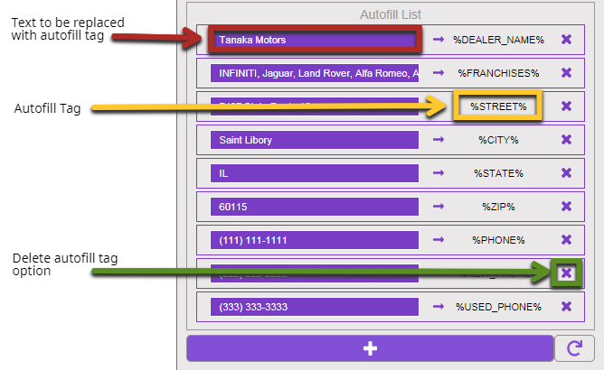
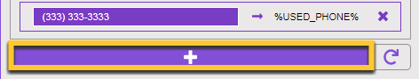

[](https://codebeat.co/projects/github-com-cirept-autofillreplacer-master)

# autofillReplacer
a tool that will replace text with autofill tags

## Description
* This tool will crawl the editor window and replace all matching text with the designated autofill tag.
* Primarily meant for use WITH the migration tool.

## Additional Details
* Tool will auto save every so often
* If an input field of an AUTOFILL tag entry is empty and the page is reloaded, that field will be removed upon page reload.

## How to Use the Tool
Begin the migration process of an internal or external page.
1. On a blank landing page, choose external page to migrate.
2. 'Get' the URL of the external page
3. Choose the bucket the page will go into
4. RUN THE AUTOFILL TAG REPLACER TOOL
    * All matching text on the 'soon to be' migrated page will get replaced with its autofill tag
5. Continue with the normal steps to migrate over the content

## Working Environment(s)
* Only works in **WSM (Editor) and CMS (Content Library)**
    * **Changes made in Editor**, changes are not permanent and will revert to original text upon page reload. Main purpose of the tool would is to make migrating copy text from external sites easier.
    * **Changes made in CMS (Content Library)**, are not permanent UNTIL you save the changes via one of the save button located at the top right area of the page.
* Only works in **NextGen Mode (Next Gen toggle = ON)**

## What the tool looks like


## Magic Wand Button

* This will trigger the tool's functionality

### Editor
* Any text that has been designated inside the input areas will be found and replaced with it's corresponding Autofill tag
* **Changes will not be permanent.**

### CMS
* Any text that has been designated inside the input areas will be found and replaced with it's corresponding Autofill tag
* **Save edits in order to keep the changes.**

## Man in hat button

* This will hide / show main panel for the tool.

## Autofill Options


## Reorder Purpose (currently broken)
You may be thinking 'Why would I even need to re-order the autofill tags?'  Well great question!  Allow me to explain.
* There will be instances where text can be found in multiple autofill tags.
    * For example if you had these autofill set up in the tool:
        * INFINITI = %FRANCHISES%
        * INFINITI of Tampa = %DEALER_NAME%
    * Example Text:
        * Welcome to INFINITI of Tampa!  See yourself in a INFINITI today!
Using the example mentioned above:
1. the tool would perform a search and replace for 'INFINITI' resulting in:
    * Welcome to %FRANCHISES% of Tampa!  See yourself in a %FRANCHISES% today!
2. the tool will now perform a search and replace for 'INFINITI of Tampa' resulting in:
    * Welcome to %FRANCHISES% of Tampa!  See yourself in a %FRANCHISES% today!
    * As you can see nothing happened.  Because it didn't find an exact match = INFINITI of Tampa

If we reversed the order and moved %DEALER_NAME% first then %FRANCHISES% the tool will perform as expected.
* Tool Set up:
    * INFINITI of Tampa = %DEALER_NAME%
    * INFINITI = %FRANCHISES%
* Run tool on example above

1. Search for 'INFINITI of Tampa'
    * Welcome to %DEALER_NAME%!  See yourself in a INFINITI today!
2. Search for 'INFINITI'
    * Welcome to %DEALER_NAME%!  See yourself in a %FRANCHISES% today!

## Text to be replaced
Because some dealer's like to use different text for things.
* e.g. INFINITI of Tampa, could also be
    * Tampa INFINITI
    * INFINITI Tampa
* So to account for this, you can adjust the 'text to be replaced' and add all possible variations to the area.
* You can separate the variations by using two back-ticks `` (the key above the 'tab' on your keyboard)

### Lets do a quick demo shall we?
Using the text mentioned above.  I want to replace anything related to the dealer's name with the autofill tag %DEALER_NAME%.  So I write this text into the autofill text area.
```
INFINITI of Tampa``Tampa INFINITI``INFINITI Tampa
```


When you click the 'Magic' button the tool will break down the text if it sees `` and start its search.
* round 1 = INFINITI of Tampa
* round 2 = Tampa INFINITI
* round 3 = INFINITI Tampa

## Delete autofill
it will remove the autofill tag from the search list

## Add autofill Button


Clicking this will display a drop down of currently available autofill tags that looks like this.

## Why are the options grey'd out?


Autofill tags that have already been configured will be disabled. (Depicted in grey in the screenshot)
