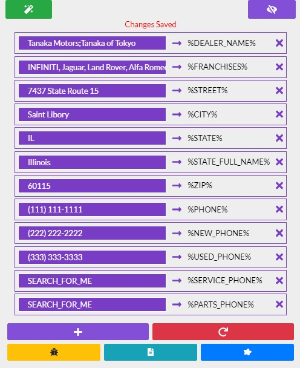

# Read Me

## Autofill Tool

### Description

* This tool will crawl the editor window and replace all matching text with the designated autofill tag.
* **Primarily meant for use WITH the migration tool.**

#### Working Environment\(s\)

* Only works in **Next Gen Mode \(Next Gen toggle = ON\)**
* Only works in **WSM \(Editor\) and CMS \(Content Library\)**
  * **Changes made in Editor**, changes are not permanent and will revert to original text upon page reload. Main purpose of the tool would is to make migrating copy text from external sites easier.
  * **Changes made in CMS \(Content Library\)**, are not permanent UNTIL you save the changes via one of the save button located at the top right area of the page.

#### Additional Details

* Tool will auto save after every change to the input areas.
  * Adding text
  * Deleting autofill entries
  * Adding autofill entries
* Tool now resets to defaults if you switch from web-id to web-id.
  * **The tool does this upon loading.**
  * The message display you see when you show the autofill list is in place just to remind you that the tool was reset.

### Suggested Use of Tool

#### During the Migration Process

1. Begin the migration process of an internal or external page.
2. On a blank landing page, choose external page to migrate.
3. **Get** the URL of the external page
4. Choose the bucket the page will go into
5. **THE AUTOFILL TAG REPLACER TOOL**
6. Continue with the normal steps to migrate over the content

#### During Page Editing

1. Choose a card to edit
2. Choose to edit **Content**
3. A pop up will appear.
4. **RUN THE AUTOFILL TAG REPLACER TOOL**
5. Save changes via **save** button.

### Tool Buttons

#### Magic Wand Button

* This will trigger the tool "text replace" functionality.

#### Magic Eye Button

* This will hide / show main panel for the tool.

#### Autofill Entry

* Where you will enter the custom text to be replaced on the web page.

#### Add Autofill

* Will add a new autofill entry to the tool.

#### Reset Button

* Will reset all of the current autofill entries to the default list.

#### Report Bug Button

* Links directly to the GitHub repo where you can submit a bug report.

#### Latest Changes Button

* View the latest changes to the tool.

#### Request Enhancement Button

* Links directly to the GitHub repo where you can submit an enhancement request.

