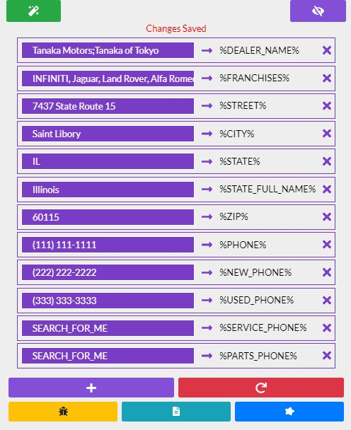

# Overview

Let's first break down the tools visual elements with some brief descriptions about it's functionality and then dive deeper.

## Magic Wand Button

* This will trigger the tool "text replace" functionality.

## Magic Eye Button

* This will hide / show main panel for the tool.

## Autofill Entry

* Where you will enter the custom text to be replaced on the web page.

## Add Autofill

* Will add a new autofill entry to the tool.

## Reset Button

* Will reset all of the current autofill entries to the default list.

## Report Bug Button

* Links directly to the GitHub repo where you can submit a bug report.

## Latest Changes Button

* View the latest changes to the tool.

## Request Enhancement Button

* Links directly to the GitHub repo where you can submit an enhancement request.

